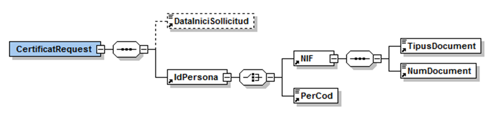
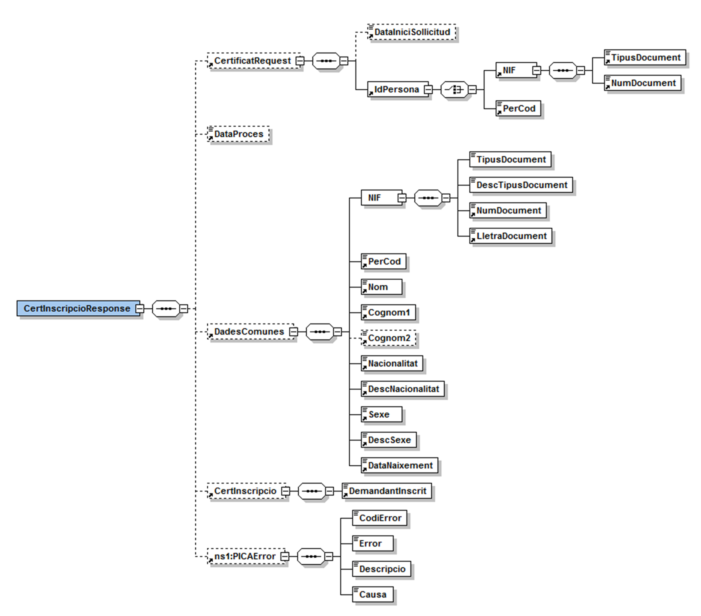
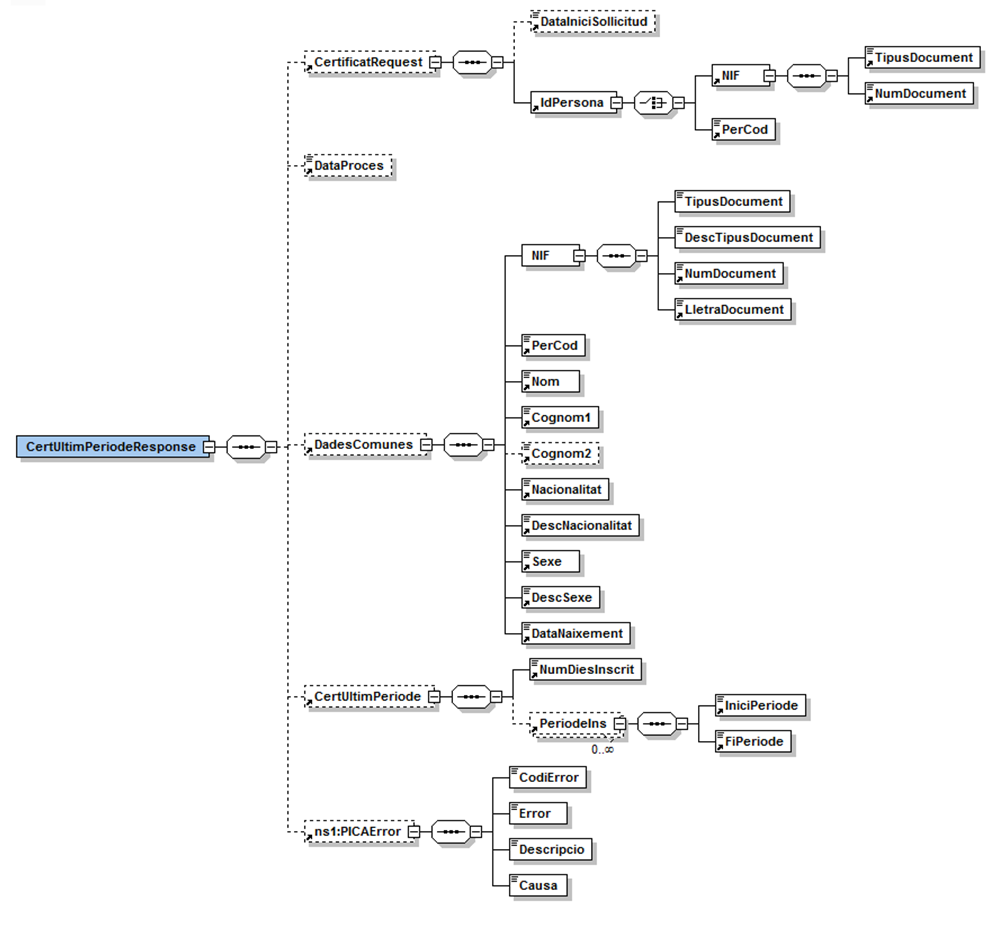
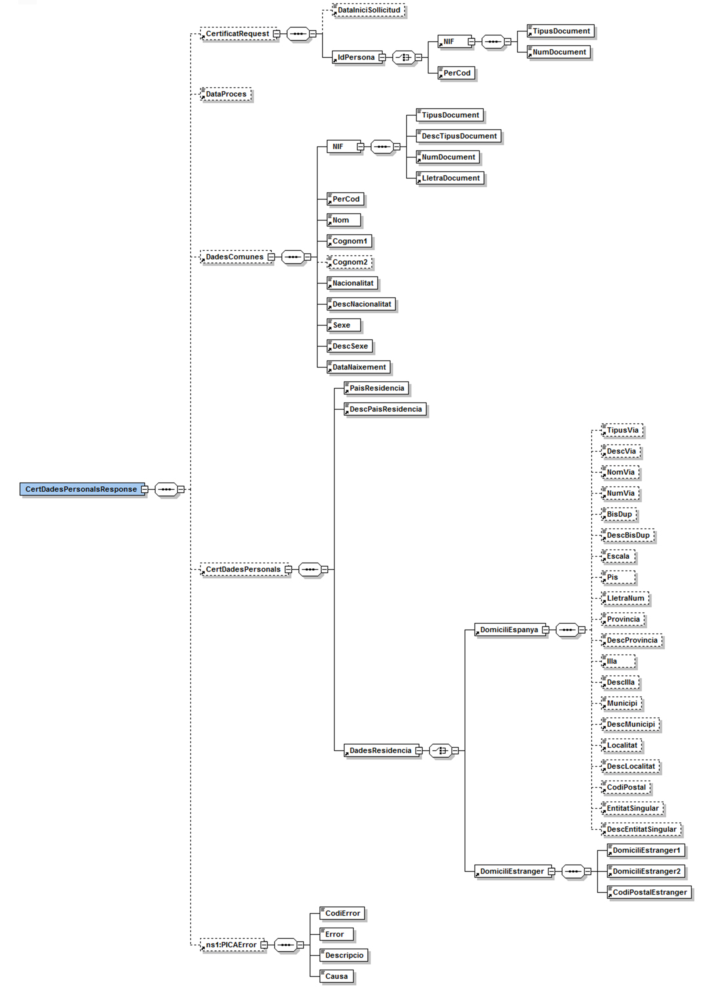
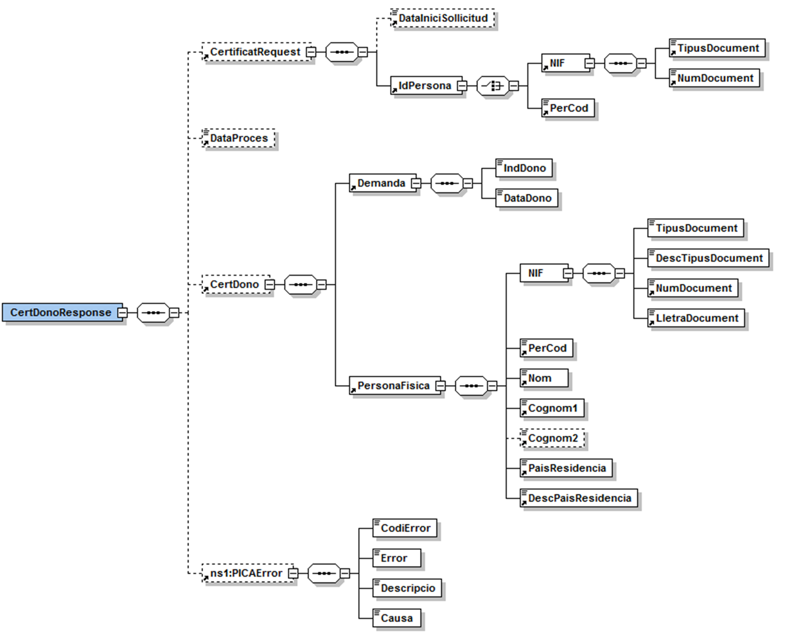

# VO-SOC Document d&#39;integració del servei

# **Via Oberta – Servei d&#39;Ocupació de Catalunya**

## INDEX

- [1. Introducció](#1)
- [2. Transmissions de dades disponibles](#2)
- [3. Missatgeria del servei](#3)
   * [3.1 Certificat d&#39;inscripció del demandant (SOC\_CERT\_INSCRIPCIO)](#3.1)
        * [3.1.1 Petició – dades específiques](#3.1.1)
		* [3.1.2 Resposta – dades específiques](#3.1.2)
   * [3.2 Certificat de període d&#39;inscripció (SOC\_CERT\_ULTIMPERIODE)](#3.2)
        * [3.2.1 Petició – dades específiques](#3.2.1)
		* [3.2.2 Resposta – dades específiques](#3.2.2)
   * [3.3 Certificat de dades personal (SOC\_CERT\_DADESPERSONALS)](#3.3)
        * [3.3.1 Petició – dades específiques](#3.3.1)
		* [3.3.2 Resposta – dades específiques ](#3.3.2)
   * [3.4 Certificat de demandant d&#39;ocupació no ocupat (SOC\_CERT\_DONO)](#3.4)
        * [3.4.1 Petició – dades específiques](#3.4.1)
		* [3.4.2 Resposta – dades específiques ](#3.4.2)
-  [4. Joc de proves](#4)

**Històric de revisions**

| **Versió** | **Data** | **Autor** | **Comentaris** |
| --- | --- | --- | --- |
| V1.0 | 17/01/2009 | Roger Noguera Arnau | Creació del document |
| V2.0 | 08/07/2010 | Roger Noguera Arnau | Incorpora modalitat SOC\_CERT\_DONO |
| V2.1 | 09/08/2012 | Llorenç Camps Vicente | Actualització del joc de proves |
| V2.2 | 09/07/2014 | Llorenç Camps Vicente | Camp Codi SOC obsolet. |
| V2.3 | 12/04/2021 | Roger Noguera Arnau | Baixa de la modalitat SOC\_CERT\_PERCEPTOR. |

# 1 Introducció 

Aquest document detalla la missatgeria associada al servei del Servei d&#39;Ocupació de Catalunya (SOC en endavant).

Per poder realitzar la integració cal conèixer prèviament la següent documentació:

- Document del Servei Via Oberta.
- [Document de Missatgeria Genèrica de la PCI del Consorci AOC.][PCI]

[PCI]:https://github.com/ConsorciAOC/PCI

# 2 Transmissions de dades disponibles 

Les dades disponibles a través del servei són les que es presenten a continuació:

| **EMISSOR** |
| --- |
| SOC (Servei d&#39;Ocupació de Catalunya) |

| **PRODUCTE** | **MODALITAT** | **DESCRIPCIO** |
| --- | --- | --- |
| **SOC** | SOC\_CERT\_INSCRIPCIO | Certificat d&#39;inscripció de demandant d&#39;ocupació. |
| **SOC** |  SOC\_CERT\_ULTIMPERIODE | Certificat de períodes d&#39;inscripció. |
| **SOC** |  SOC\_CERT\_DADESPERSONALS | Certificat de dades personals. |
| **SOC** |  SOC\_CERT\_DONO | Certificat de demandant d&#39;ocupació no ocupat. |

# 3 Missatgeria del servei 

A continuació es detalla la missatgeria corresponent al bloc de dades específiques de les modalitats de consum del producte SOC.

## 3.1 Certificat d&#39;inscripció del demandant (SOC\_CERT\_INSCRIPCIO) 

    
### 3.1.1 Petició – dades específiques 

| _Element_ | _Descripció_ |
| --- | --- |
| CertificatRequest/DataIniciSollicitud | Únicament aplica a la modalitat _Certificat d&#39;últim període d&#39;inscripció_ i delimita la data d&#39;inici de la sol·licitud. |
| CertificatRequest/IdPersona/NIF/TipusDocument | Tipus de document d&#39;identitat (3: NIF, 5: NIE, 6: Ciutadans pertanyents al E.E.E/UE/ confederació Suïssa sense nacionalitat espanyola, que no estan en possessió de NIE, 7: Ciutadans no pertanyents al E.E.E/UE/ confederació Suïssa, amb familiars comunitaris o pertanyents a E.E.E/UE/ confederació Suïssa). |
| CertificatRequest/IdPersona/NIF/NumDocument | Número de document d&#39;identitat. Format (D: dígit, A: lletra): NIF: DDDDDDDDA, NIE: XDDDDDDDDD, altres: DDDDDDDDA. |
| CertificatRequest/PerCod | _ **Camp obsolet** _. Identificació del demandant mitjançant el codi intern de la plataforma del SOC. En cas d&#39;informar aquest codi, no es requereix informar el bloc de dades NIF. |

    
### 3.1.2 Resposta – dades específiques 

| _Element_ | _Descripció_ |
| --- | --- |
| CertInscripcioResponse/CertificatRequest | Dades de la petició. Vegeu  [l&#39;apartat 3.1.1](#3.1.1)|
| CertInscripcioResponse/DataProces | Data de processament de la petició per part de la plataforma del SOC. |
| CertInscripcioResponse/DadesComunes | Dades del titular informat en la petició. Vegeu apartat 3.1.2.1 |
| CertInscripcioResponse/CertInscripció/DemandantInscrit | Indicador de si el titular està inscrit (S | N). |
| CertPerceptorResponse/PICAError | Detalls de l&#39;incidència en cas d&#39;error processant la petició. Vegeu apartat 3.1.2.2 |

#### 3.1.2.1 Dades comunes

| _Element_ | _Descripció_ |
| --- | --- |
| //DadesComunes/NIF/TipusDocument | D: persones amb nacionalitat espanyola en possessió de DNI, E: persones sense nacionalitat espanyola en possessió de NIE, U: ciutadans pertanyents al E.E.E/UE/ confederació Suïssa sense nacionalitat espanyola que no estan en possessió de NIE., W: Ciutadans no pertanyents al E.E.E/UE/ confederació Suïssa amb familiars comunitaris o pertanyents a E.E.E/UE/ confederació Suïssa. |
| //DadesComunes/NIF/DescTipusDocument | Descripció del tipus de document d&#39;identitat. |
| //DadesComunes/NIF/NumDocument | Número de document d&#39;identitat. |
| //DadesComunes/NIF/LletraDocument | Lletra del NIF. |
| //DadesComunes/PerCod |**Camp obsolet**  Codi intern de la plataforma del SOC que identifica el demandant. |
| //DadesComunes/Nom | Nom del demandant. |
| //DadesComunes/Cognom1 | Primer cognom del demandant. |
| //DadesComunes/Cognom2 | Segon cognom del demandant. |
| //DadesComunes/Nacionalitat | Codi de la nacionalitat del demandant. |
| //DadesComunes/DescNacionalitat | Descripció de la nacionalitat del demandant. |
| //DadesComunes/Sexe | Codi de sexe del demandant (1, 2). |
| //DadesComunes/DescSexe | Descripció del sexe del demandant (1, 2). |
| //DadesComunes/DataNaixement | Data de naixement del demandant. |

#### 3.1.2.2 Dades d&#39;error

| _Element_ | _Descripció_ |
| --- | --- |
| //PICAError/CodiError | Codi d&#39;error. |
| //PICAError/Error | Literal o excepció associada a l&#39;error. |
| //PICAError/Descripcio | Descripció de l&#39;error. |
| //PICAError/Causa | Traça de detall de l&#39;error. |

## 3.2 Certificat de període d&#39;inscripció (SOC\_CERT\_ULTIMPERIODE) 

    
### 3.2.1 Petició – dades específiques 

El format de la petició és identic al detallat a [l&#39;apartat 3.1.1](#3.1.1)

### 3.2.2 Resposta – dades específiques 

| _Element_ | _Descripció_ |
| --- | --- |
| CertUltimPeriodeResponse/CertificatRequest | Dades de la petició. Vegeu [l&#39;apartat 3.1.1](#3.1.1) |
| CertUltimPeriodeResponse/DataProces | Data de processament de la petició per part de la plataforma del SOC. |
| CertUltimPeriodeResponse/DadesComunes | Dades del titular informat en la petició. Vegeu apartat 3.1.2.1 |
| CertUltimPeriodeResponse/CertInscripció/NumDiesInscrit | Nombre de dies que consta que la persona està inscrita com a demandant d&#39;ocupació des de la data d&#39;inici de la sol·licitud. |
| CertUltimPeriodeResponse/PeriodeIns/IniciPeriode | Data d&#39;inici del període. |
| CertUltimPeriodeResponse/PeriodeIns/FiPeriode | Data de finalització del període. |
| CertUltimPeriodeResponse/PICAError | Detalls de l&#39;incidència en cas d&#39;error processant la petició. Vegeu apartat 3.1.2.2 |

 
## 3.3 Certificat de dades personal (SOC\_CERT\_DADESPERSONALS) 

    
### 3.3.1 Petició – dades específiques 

El format de la petició és identic al detallat a [l&#39;apartat 3.1.1](#3.1.1)

    
### 3.3.2 Resposta – dades específiques 

| _Element_ | _Descripció_ |
| --- | --- |
| CertDadesPersonalsResponse/CertificatRequest | Dades de la petició. Vegeu apartat 3.1.1 |
| CertDadesPersonalsResponse/DataProces | Data de processament de la petició per part de la plataforma del SOC. |
| CertDadesPersonalsResponse/DadesComunes | Dades del titular informat en la petició. Vegeu apartat 3.1.2.1 |
| CertDadesPersonalsResponse/CertDadesPersonals/PaisResidencia | Codi de país de residència. |
| CertDadesPersonalsResponse/CertDadesPersonals/DescPaisResidencia | Descripció de país de residència. |
| CertDadesPersonalsResponse/CertDadesPersonals/DadesResidencia/DomiciliEspanya/TipusVia | Codi de tipus de via. |
| CertDadesPersonalsResponse/CertDadesPersonals/DadesResidencia/DomiciliEspanya/DescVia | Descripció de tipus de via. |
| CertDadesPersonalsResponse/CertDadesPersonals/DadesResidencia/DomiciliEspanya/NomVia | Nom de via. |
| CertDadesPersonalsResponse/CertDadesPersonals/DadesResidencia/DomiciliEspanya/NumVia | Número de la via. |
| CertDadesPersonalsResponse/CertDadesPersonals/DadesResidencia/DomiciliEspanya/BisDup | Bis / duplicat de l&#39;escala. |
| CertDadesPersonalsResponse/CertDadesPersonals/DadesResidencia/DomiciliEspanya/DescBisDup | Descripció bis / duplicat de l&#39;escala. |
| CertDadesPersonalsResponse/CertDadesPersonals/DadesResidencia/DomiciliEspanya/Escala | Escala. |
| CertDadesPersonalsResponse/CertDadesPersonals/DadesResidencia/DomiciliEspanya/Pis | Pis. |
| CertDadesPersonalsResponse/CertDadesPersonals/DadesResidencia/DomiciliEspanya/LletraNum | Lletra. |
| CertDadesPersonalsResponse/CertDadesPersonals/DadesResidencia/DomiciliEspanya/Provincia | Codi de província. |
| CertDadesPersonalsResponse/CertDadesPersonals/DadesResidencia/DomiciliEspanya/DescProvincia | Descripció de província. |
| CertDadesPersonalsResponse/CertDadesPersonals/DadesResidencia/DomiciliEspanya/Illa | Codi d&#39;illa. |
| CertDadesPersonalsResponse/CertDadesPersonals/DadesResidencia/DomiciliEspanya/DescIlla | Descripció d&#39;illa. |
| CertDadesPersonalsResponse/CertDadesPersonals/DadesResidencia/DomiciliEspanya/Municipi | Codi de municipi. |
| CertDadesPersonalsResponse/CertDadesPersonals/DadesResidencia/DomiciliEspanya/DescMunicipi | Descripció de municipi. |
| CertDadesPersonalsResponse/CertDadesPersonals/DadesResidencia/DomiciliEspanya/Localitat | Codi de localitat. |
| CertDadesPersonalsResponse/CertDadesPersonals/DadesResidencia/DomiciliEspanya/DescLocalitat | Descripció de localitat. |
| CertDadesPersonalsResponse/CertDadesPersonals/DadesResidencia/DomiciliEspanya/CodiPostal | Codi postal. |
| CertDadesPersonalsResponse/CertDadesPersonals/DadesResidencia/DomiciliEspanya/EntitatSingular | Codi d&#39;entital singular, |
| CertDadesPersonalsResponse/CertDadesPersonals/DadesResidencia/DomiciliEspanya/DescEntitatSingular | Descripció d&#39;entital singular, |
| CertDadesPersonalsResponse/CertDadesPersonals/DadesResidencia/DomiciliEstranger/DomiciliEstranger1 | Domicili estranger 1. |
| CertDadesPersonalsResponse/CertDadesPersonals/DadesResidencia/DomiciliEstranger/DomiciliEstranger2 | Domicili estranger 2. |
| CertDadesPersonalsResponse/CertDadesPersonals/DadesResidencia/DomiciliEstranger/CodiPostalEstranger | Codi de domicili estranger. |
| CertDadesPersonalsResponse/PICAError | Detalls de l&#39;incidència en cas d&#39;error processant la petició. Vegeu apartat 3.1.2.2 |

## 3.4 Certificat de demandant d&#39;ocupació no ocupat (SOC\_CERT\_DONO) 

    
### 3.4.1 Petició – dades específiques 

El format de la petició és identic al detallat a [l&#39;apartat 3.1.1](#3.1.1)

    
### 3.4.2 Resposta – dades específiques 

| _Element_ | _Descripció_ |
| --- | --- |
| CertDonoResponse/CertificatRequest | Dades de la petició. Vegeu apartat 3.1.1 |
| CertDonoResponse/DataProces | Data de processament de la petició per part de la plataforma del SOC. |
| CertDonoResponse/CertDono/Demanda | Bloc amb les dades de la demanda. |
| //Demanda/IndDono | Indicador de si la demanada és DONO (S, N). |
| //Demanda/DataDono | Data en la que s&#39;ha calculat si la demanda és DONO. |
| CertDonoResponse/CertDono/PersonaFisica | Bloc amb les dades de la persona. |
| //PersonaFisica/NIF/TipusDocument | D: persones amb nacionalitat espanyola en possessió de DNI, E: persones sense nacionalitat espanyola en possessió de NIE, U: ciutadans pertanyents al E.E.E/UE/ confederació Suïssa sense nacionalitat espanyola que no estan en possessió de NIE., W: Ciutadans no pertanyents al E.E.E/UE/ confederació Suïssa amb familiars comunitaris o pertanyents a E.E.E/UE/ confederació Suïssa. |
| //PersonaFisica/NIF/DescTipusDocument | Descripció del tipus de document d&#39;identitat. |
| //PersonaFisica/NIF/NumDocument | Número de document d&#39;identitat. |
| //PersonaFisica/NIF/LletraDocument | Lletra del NIF. |
| //PersonaFisica/PerCod | _ **Camp obsolet.** _ Codi intern de la plataforma del SOC que identifica el demandant. |
| //PersonaFisica/Nom | Nom del demandant.|
| //PersonaFisica/Cognom1 | Primer cognom del demandant. |
| //PersonaFisica/Cognom2 | Segon cognom del demandant. |
| //PersonaFisica/PaisResidencia | Codi de pais de residència. |
| //PersonaFisica/DescPaisResidencia | Descripció del país de residència. |
| CertDonoResponse/PICAError | Detalls de l&#39;incidència en cas d&#39;error processant la petició. [l&#39;apartat 3.1.2](#3.1.2) |

# 4 Joc de proves 

L&#39;emissor final publica els següent [joc de proves a l&#39;entorn de pre-producció][proves] 

[proves]: http://transversals.ctti.intranet.gencat.cat/sol-pica-iop-gene

 En cas de tindre problemes per accedir als jocs de proves, si us plau, obre un tiquet a través del [formulari][form]

[form]:https://suport.aoc.cat/hc/ca/requests/new
